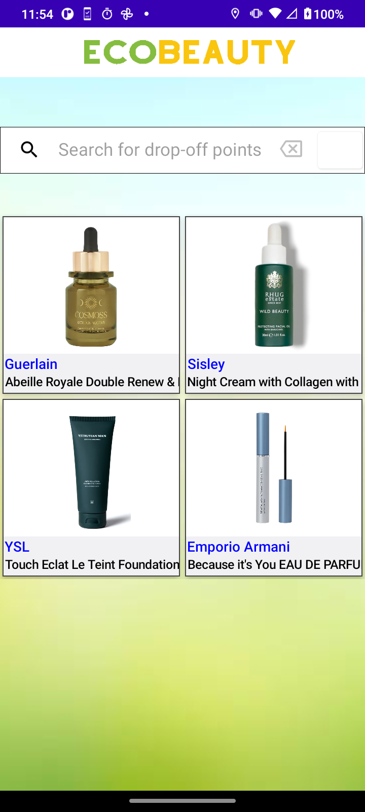
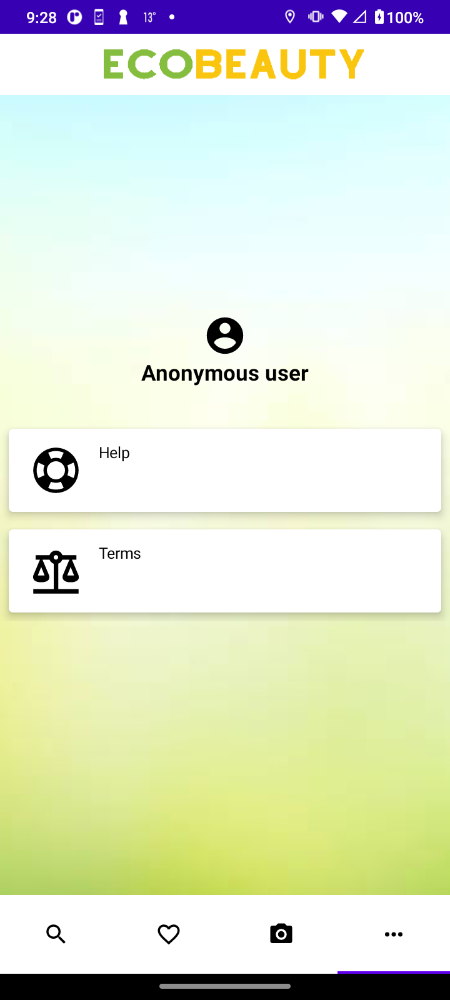
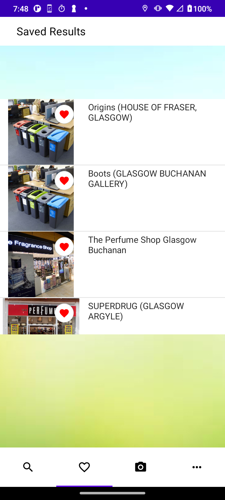
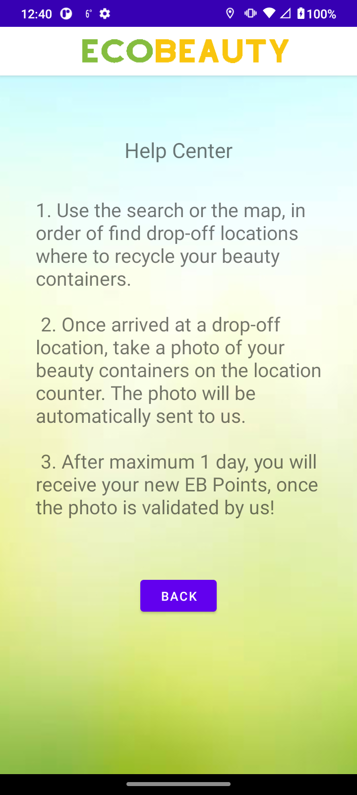
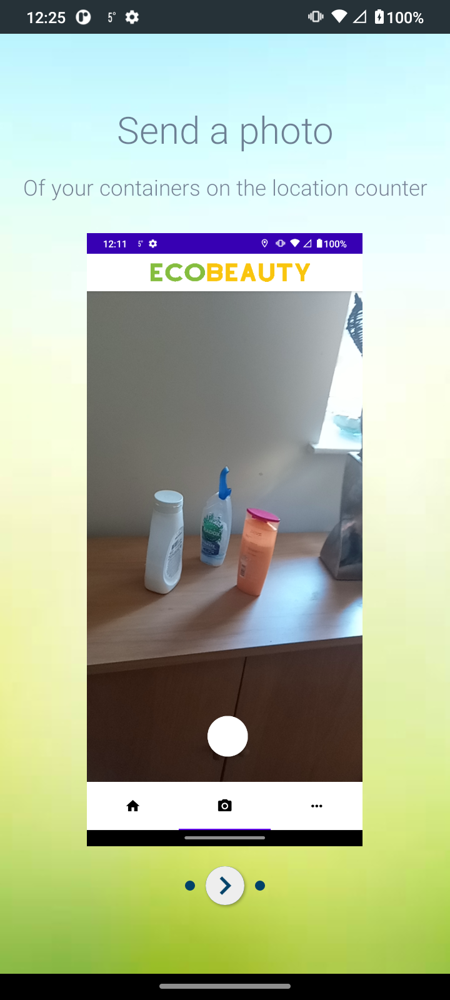
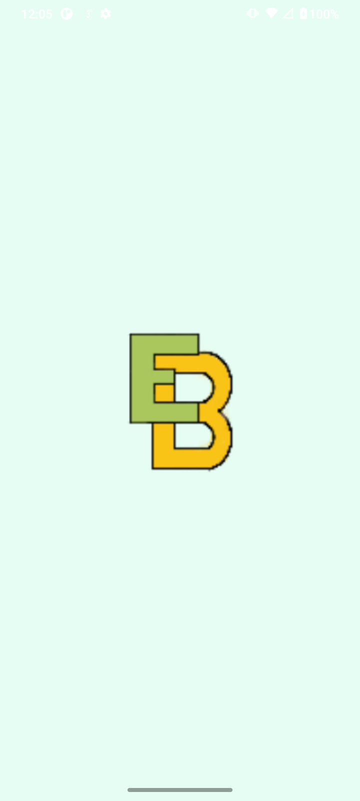
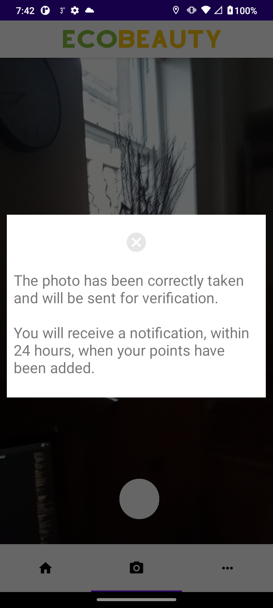
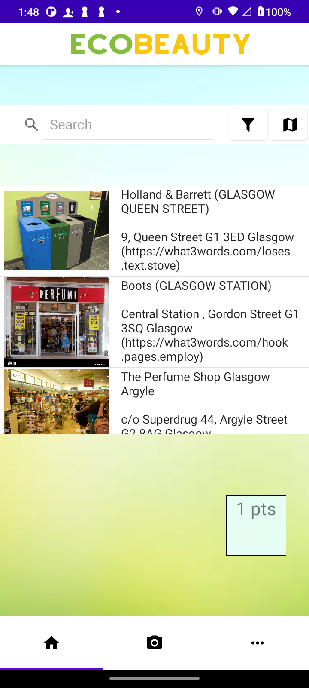
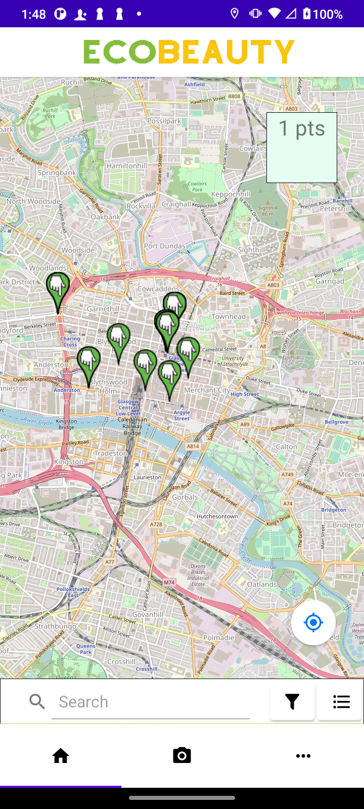
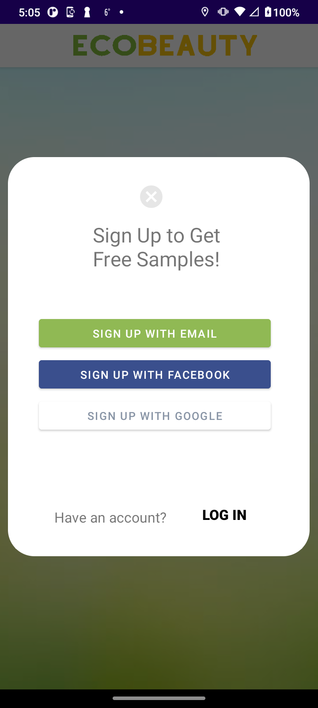

# BeautyAndroid
A mobile app I built as part of a start-up collaboration.

The application is written in Java and Kotlin for Android.

It is based on a framework library I developed as well: https://github.com/mathieudelehaye/AndroidJavaTools 

The following views are managed by this mobile application:

- OpenStreetMap map view: src/main/java/com/android/java/androidjavatools/controller/tabview/result/map
- camera: src/main/java/com/android/java/androidjavatools/controller/tabview/camera
- onboarding screen: src/main/java/com/android/java/androidjavatools/controller/onboard
- search suggestions: src/main/java/com/android/java/androidjavatools/controller/tabview/search
- profile management: src/main/java/com/android/java/androidjavatools/controller/tabview/profile
- list view: src/main/java/com/android/java/androidjavatools/controller/tabview/result/list
- login and signup: src/main/java/com/android/java/androidjavatools/controller/tabview/auth

  
  

  
  

  
  

  
  

  
  

  
  

  
  

  
  

  
  

  
  

  
  

  

